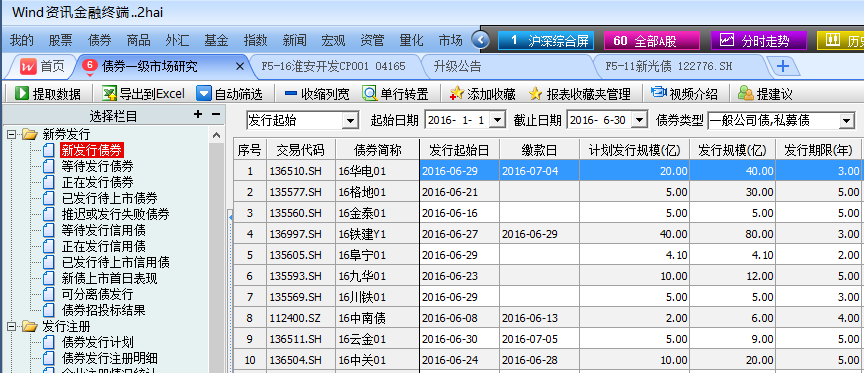

```{r prepare, message=FALSE, warning=FALSE, include=FALSE}
library(pryrk)
```

`pryrk`包（Primary Market Ranking）是用来快速查看和计算中国债券市场承销商的承销排名的R语言包，其主要依赖于Wind资讯客户端导出的债券承销数据，但也可以在此基础上进行筛选，目前该包的主要功能如下：

- 可以对债券的分类进行选择，依据“公司债”、“企业债”和“中票短融”三大种类进行选择
- 可以设置开始和结束的日期，进行区间排名统计
- 将结果导出至已格式化设置的Excel文件

`pryrk`包的使用非常简单，以下为具体介绍。 

# 快速使用指南

虽然`pryrk`包中包含了多个函数，用于进行排名计算，但同时包含了一个综合函数`rank`可以调用这些基础函数直接得到结果，即前民提到的包的主要功能都可以通过`rank`函数实现。注意，如要再使用`base`包中的`rank`函数，需要使用`base::rank`。

在使用`library(pryrk)`载入包之后，可以直接输入`rank()`获得排名数据：

```{r size='small'}
rank()
```

可以看到这里完全没有输入任何参数，需要注意的是，尽管参数都已经有默认值，包括输入的文件名`file`，其默认值是`file="bond.xlsx"`，即在当前的工作目录下应当存在一个`bond.xlsx`的数据文件以供函数提取数据，才能进行计算排名。

因此，只要在Wind资讯客户端提取了想要进行排名的数据文件，存为当前目录下的`bond.xlsx`，然后直接使用`rank()`即能看到前20名承销商的排名情况。

# 数据说明

## 原始数据输入

为了得到承销商的承销业绩排名，所谓的原始数据输入，就是通过Wind资讯终端导出的债券发行数据。在Wind资讯终端中的**债券**菜单下，选择**专题研究**中的**一级市场**，或者直接输入**BPM**，在进入到债券一级市场研究的界面后，在左侧的栏目中最上端选择**新发行债券**，此时就可以看到债券发行列表，并可以进行筛选。如下图所示：



可以看到，在此处查询数据时，即可对源数据进行筛选，得到符合要求的源数据后，得到的排名结果也就不需要进行任何调整。

## 排名结果说明

排名结果为分三组，其中第一组为**数量排名**，这里的数量排名区别于Wind资讯终端里面的数量排名，也是`pryrk`包的*特别之处*，即这里的数量是指算术平均处理过的数量排名，任何一个承销机构，其独立主承销的债券在计算数量时加1，而如果联系主承销时，则数量增加N分之一，N为联席主承销商的数量。这样的计算方式在数量统计上更显公平，避免部分承销机构大量“挂名”以虚增承销业绩。

另外两组排名为规模排名和绝对数量排名，这两组排名与Wind资讯终端里面的承销商排名统计基本一致，即承销机构的承销总规模，需要注意的是对于规模的处理，Wind资讯终端和`pryrk`包均采取了与数量处理时相同的算术平均处理。而绝对数量排名就是指只要承销机构参与了一只债券的承销，则绝对承销数量加1，起参考作用。

在三组排名中，均包含了指标值和排名次序，其中数量排名和规模排名还统计了占比，但绝对数量排名没有加入占比，这是由于绝对数量的统计中大量重复计算，该列所有值加和并不等于总体债券发行数量，因此使用占比统计是*没有意义*的。

下面的例表当中可以看到上面对于指标的解释：

```{r, echo=FALSE, results='asis'}
knitr::kable(head(uwrk, 10), caption='承销排名示例', format='latex')
```

# 参数说明

本包中的主要工作函数`rank`虽然有一定参数，但并不复杂，主要是传递至实际调用的函数，其包括的参数如下：

```{r}
args(rank)
```

对其主要参数做如下说明：

- `envir`：这个参数的默认值是全局环境，其设计初衷是为了让使用者可以选择将相关数据统一存放在一个具体环境中，以保证全局环境的*整洁*，但实际当中使用预计较少，如果确有需要应使用`new.environment`首先建立相应的环境；

- `file`：输入的Excel文件名，应包含完整路径名，由于传递至`getDataUsingWind`，因此默认为当前工作目录下的`bond.xlsx`文件；

- `update`：默认为FALSE，即函数会指定每一步生成的数据的对象名称，默认在给定的`envir`环境中查找这些数据对象，如果找到则不会重新提取或计算，以减少时间消耗，但如果更换了数据文件等情况下，则应设置`update=TRUE`；

- `save`：默认为为FALSE，需要保存为Excel文件时设置为TRUE；

- `open`：当`save`为TRUE时，可以设置`open=TRUE`在保存之后直接打开Excel文件；

- `print.head`：默认`rank`函数直接在终端输出排名结果的前20以便快速查看，也可以设为FALSE不进行输出，例如仅保存结果文件等。

以上是`rank`函数的工作参数，此外还可以设置几个筛选参数，对数据集进行筛选：

- `type`：筛选排序的债券类型，这里主要按照目前中国债券市场上的三个信用债品种进行筛选，包括“公司债”、“企业债”和“中票短融”，以字符串的形式给出，其他输入会出错，其中“中票短融”就是指所有*非金融企业债务融资工具*；

- `start`，`end`：起止日期，可以筛选数据集的日期子区间，目前函数要求两个日期都必须给定，否则不会进行日期筛选；

- `date_type`：此处仅能输入`initdate`和`carrydate`，分别指**发行起始日**和**起息日**，默认为发行起始日，这也符合一般的管理。

# 补充探讨

## 关于数据原始文件和条件筛选

前面已经对数据原始文件和条件筛选做出了一定说明，这里需要补充的是，由于数据的原始文件是从Wind资讯终端导出，因此在导出数据时，这一过程就可以包含对数据的筛选，从前面的图片中可以看出，`rank`函数的筛选参数在Wind终端中都已存在，因此，如果做**简单统计**，则可以在Wind终端中筛选好数据，直接`rank`得到结果。

这里的主要问题是导出的Excel文件可能较大，所以筛选过的导出文件会相对较小，因此会提升工作效率。

当然，如果想要做多次筛选查看排名情况，则可以在导出数据时导出一个未经筛选的较大范围的债券发行表，当然要注意Wind终端对于提取数据的限制。这样做虽然在第一次读入数据时耗费一定时间，但未来的多次筛选排名过程中，只要不设置`update=TRUE`就会很快得到结果。

综上，不同的工作要求和目的，决定了如何进行筛选和使用导出文件。

值得**注意**的是，Wind终端在导出债券文件时会自动加入汇总行和数据源标识，应在导出完成自动打开文件时删除这些行，否则会在读取时出错。

## 关于原始数据

尽管前面一再提及录入数据是使用Wind资讯导出的发行数据，事实上也并非绝对如此，特别是对于公募发行的债券，通过公开渠道获取发行信息的方式有很多，只要汇集了这些信息，存为一个Excel表就可以作为原始数据文件，并得到排名。这是由于在`getDataUsingWind`函数中有如下代码：

```{r, eval=FALSE}
col_names <- c('交易代码', '债券简称', '发行规模', '计划发行规模',
               '主承销商', '发行起始日', '起息日')
```

这是用于提取Wind终端导出表中所需要的几列的，因此，自行统计汇总的表中只要包含这几列，且格式正确，则可以被正确处理并得到排名结果。**此外**，要注意主承销商处，如果有联系主承销的情况，多家机构名称应使用半角的逗号——`,`隔开。

# 未来可能的开发安排

目前的功能已经满足了开发初衷，但确实仍有改进空间，主要体现在以下几个方面：

1. 导出文件功能实现多页面存为Excel文件，例如，可以对某一年的发行数据中，按照三个信用债类型分别统计承销排名，每个排名都作为一个*Sheet*，保存为一个Excel文件。

2. 汇总统计，可以对排名区间或类型的债券发行做简要汇总统计。

3. 单个承销机构的不同时期承销业绩统计，并绘图。

4. 构建单独的承销数据基础数据库，该计划工程较大，预计实施可能性不高。
